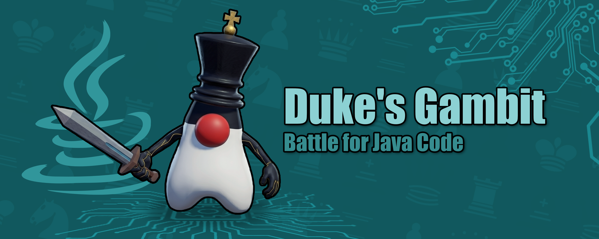
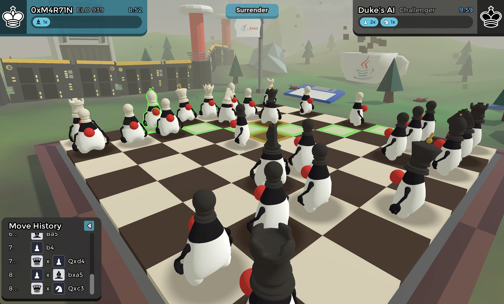
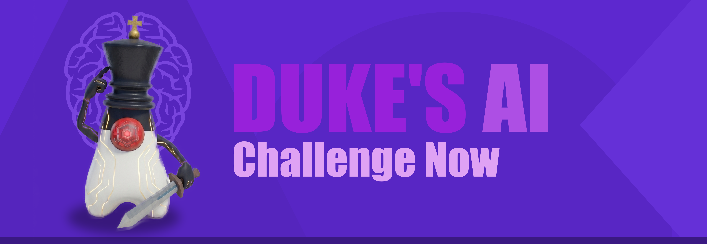

<div align="center">

# Duke's Gambit: Battle for Java Code

[](https://godotengine.org/)
[](dukes_ai/)
[](server/)
[](server/docker-compose.yml)
[](LICENSE)

[](https://github.com/0xMartin/Duke-s-Gambit/actions/workflows/build-native.yml)
[](https://github.com/0xMartin/Duke-s-Gambit/actions/workflows/ci.yml)

**A 3D chess game with animated piece duels, a native C++ AI, and online multiplayer — built in Godot 4.**

</div>

## 📑 Table of contents

- [Download & play](#-download--play)
- [Controls](#-controls)
- [Combat in action](#️-combat-in-action)
- [AI opponent](#-ai-opponent)
- [Online multiplayer](#-online-multiplayer)
- [Assets & credits](#-assets--credits)
- [License](#-license)
- [Author](#-author)

> [!NOTE]
> **Disclaimer:** This is an open-source, non-commercial fan game made for satirical and educational purposes. `Java` is a trademark of Oracle Corporation. This project is not affiliated with, endorsed, or sponsored by Oracle.

---



Duke's Gambit is a fully-featured 3D chess game built in **Godot 4**. The rules are standard chess — what sets it apart is the presentation: all pieces are fully animated 3D characters from the Java world, the environment is stylised and thematic, and captures play out as short combat sequences rather than a simple disappearance. ♟️

**Features at a glance:**

- Full chess rule set — en passant, castling, promotion, threefold repetition, 50-move rule
- Animated 3D piece combat with hit & death effects
- Local PvP, single-player vs AI, and online multiplayer
- Stylised visuals with custom shaders, VFX, and a dynamic skybox
- Fully themed UI with custom fonts, panels, and sound design

---

## 📥 Download & play

Pre-built binaries are available on the GitHub Releases page — pick the build for your platform and run it:

**➡️ [Download the latest release](https://github.com/0xMartin/Duke-s-Gambit/releases/latest)**

The native C++ AI is built in CI for Windows, macOS, Linux, and Android — see the [Build Native AI workflow](https://github.com/0xMartin/Duke-s-Gambit/actions/workflows/build-native.yml) for the latest artifacts.

---

## 🎮 Controls

### Desktop (PC)

| Action | Input |
|---|---|
| Select piece / tile | **Left mouse click** |
| Rotate camera (orbit) | **Right mouse drag** |
| Zoom in / out | **Mouse wheel** |
| Pan camera pivot | **Middle mouse drag** |

### Mobile (touch)

| Action | Input |
|---|---|
| Select piece / tile | **Tap** |
| Rotate camera (orbit) | **One-finger drag** |
| Zoom in / out | **Two-finger pinch** |

> [!TIP]
> Camera pan & tilt sensitivity can be adjusted in **Settings → Camera**.

---

## ⚔️ Combat in action


When a piece is captured, it doesn't just disappear. Pieces engage in a brief duel — attack animations play out, the loser staggers and falls to the ground. Every capture tells a story.

---

## 🤖 AI opponent



Duke's Gambit includes a **native C++ chess AI** built as a [GDExtension](dukes_ai/) — it runs directly inside Godot with no external process or network call. The engine is a from-scratch implementation: bitboard move generation, iterative-deepening negamax search, and a tapered PeSTO evaluation function.

> [!NOTE]
> The AI source lives in [`dukes_ai/`](duke-s-gambit/native/dukes_ai/). It is a standalone C++ project compiled with SCons and loaded by Godot at runtime via the GDExtension API.

### Difficulty levels

| Level | Description |
|---|---|
| `CASUAL` | Shallow search, limited time budget — great for beginners or a relaxed game. |
| `CHALLENGER` | Balanced depth and time, puts up a real fight without being overwhelming. |
| `MASTER` | Uses the full search budget, aspiration windows, and Lazy SMP (up to 4 threads). Tough to beat. |

The AI scales its search depth and time limit dynamically based on the selected difficulty and the remaining clock time. It uses a shared transposition table (~16 MiB), null-move pruning, late-move reductions, and a history/killer heuristic for move ordering.

---

## 🌐 Online multiplayer


You can play Duke's Gambit against other players over the network. The game ships with a dedicated **WebSocket server** written in Python — source code is in [`server/`](server/).

### What the server supports

- **Rooms** — create a named room, optionally password-protected, others browse the list and join
- **Color & time control** — the host picks their side and the clock setting (e.g. 5+3, 10+0)
- **Authoritative clock** — the server tracks both players' remaining time and enforces timeouts
- **Draw offers** — offer, accept, or decline a draw mid-game
- **Surrender** — resign at any point
- **Graceful reconnect** — drop your connection and rejoin within a 30-second window, the game continues
- **Secure by default** — WSS (TLS) with an auto-generated self-signed certificate

> [!NOTE]
> The server is written in **Python 3.12** using `asyncio` + `websockets` and validates every move with `python-chess`. No database, no login — players just pick a nickname and get a signed session token.

### Public server

A public server is available — no setup required, just launch the game and connect:

| | |
|---|---|
| **URL** | `duke.sytes.net:8765` |
| **Max players** | 50 |

> [!TIP]
> In the game, go to **Online → Connect**, enter your nickname and paste the URL above.

### Run locally

```bash
cd server
docker compose up --build -d        # recommended — generates TLS cert automatically
```

Or without Docker:

```bash
cd server
python3 -m venv .venv && source .venv/bin/activate
pip install -r requirements.txt
DUKE_TLS=0 python -m duke_server    # plain WS for local dev
```

See [`server/README.md`](server/README.md) for the full configuration reference, wire protocol, and security notes.

---

## 📦 Assets & credits

### 3D models & art

- **All other 3D models** (board, terrain, weapons, NPC, environment, …) — created by `0xM4R71N`
- **Duke chess pieces** — [github.com/openjdk/duke](https://github.com/openjdk/duke) — edited in Blender, animated via [mixamo.com](https://www.mixamo.com/)
- **Chess icons** — [Wikimedia Commons — SVG chess pieces](https://commons.wikimedia.org/wiki/Category:SVG_chess_pieces)
- **Hit VFX** — [BinbunVFX Vol.2](https://binbun3d.itch.io/hit-fx) — autor: `Binbun`
- **Skybox** — [Godot Asset Library #579](https://godotengine.org/asset-library/asset/579) — autor: `rpgwhitelock`

### Sounds

| Sound | Author | Source |
|---|---|---|
| Music | Suno AI (generated) | — |
| Footsteps | `GiocoSound` | [421153](https://freesound.org/people/GiocoSound/sounds/421153/) · [421152](https://freesound.org/people/GiocoSound/sounds/421152/) · [421140](https://freesound.org/people/GiocoSound/sounds/421140/) |
| Hit | `CogFireStudios` | [547041](https://freesound.org/people/CogFireStudios/sounds/547041/) |
| Sword | `Robhog` | [684749](https://freesound.org/people/Robhog/sounds/684749/) |
| Death | `Breviceps` | [447922](https://freesound.org/people/Breviceps/sounds/447922/) |
| Piece select | `Vilkas_Sound` | [707041](https://freesound.org/people/Vilkas_Sound/sounds/707041/) |
| Spell | `LittleRobotSoundFactory` | [270409](https://freesound.org/people/LittleRobotSoundFactory/sounds/270409/) |
| Jump land | `MentalSanityOff` | [OpenGameArt](https://opengameart.org/content/jump-landing-sound) |
| Knight attack | `magnuswaker` | [524956](https://freesound.org/people/magnuswaker/sounds/524956/) |
| Fire loop | `PhreaKsAccount` | [46272](https://freesound.org/people/PhreaKsAccount/sounds/46272/) |

---

## 📄 License

This project is released under the **Creative Commons Attribution-NonCommercial-ShareAlike 4.0 International** license.

See the full license text in [LICENSE](LICENSE).

Third-party assets (models, sounds, VFX) are subject to their own respective licenses — refer to the [Assets & credits](#-assets--credits) section above.

---

## 👤 Author

**0xM4R71N** — [github.com/0xMartin](https://github.com/0xMartin)
